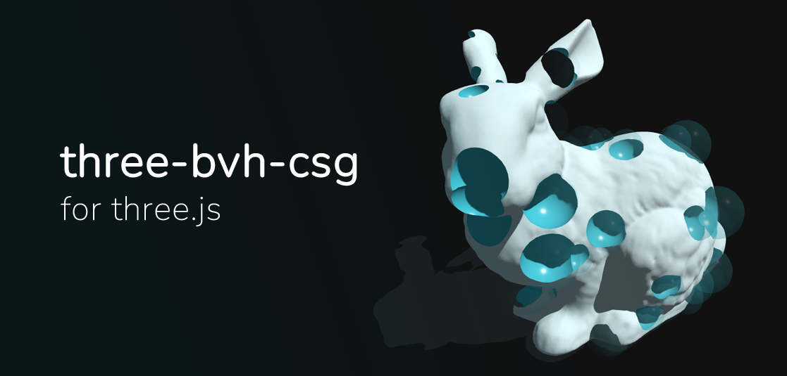

# three-bvh-csg

[](https://www.npmjs.com/package/three-bvh-csg)
[](https://lgtm.com/projects/g/gkjohnson/three-bvh-csg/)
[](https://github.com/gkjohnson/three-bvh-csg/actions)
[](https://github.com/gkjohnson/three-bvh-csg/)
[](https://twitter.com/garrettkjohnson)
[](https://github.com/sponsors/gkjohnson/)



An _experimental, in progress_, flexible, memory compact, fast and dynamic CSG implementation on top of [three-mesh-bvh](https://github.com/gkjohnson/three-mesh-bvh). More than 100 times faster than other BSP-based three.js CSG libraries in complex cases.

Contributions welcome!

# Roadmap / Help Wanted

- Fix triangle splitting / missing triangle issues [#73](https://github.com/gkjohnson/three-bvh-csg/issues/73) [#68](https://github.com/gkjohnson/three-bvh-csg/issues/68)
- Polygon splitting & triangulation [#51](https://github.com/gkjohnson/three-bvh-csg/issues/51)
- Hierarchical operations [#6](https://github.com/gkjohnson/three-bvh-csg/issues/6)
- Worker Support [#14](https://github.com/gkjohnson/three-bvh-csg/issues/14)

# Examples

[Simple CSG](https://gkjohnson.github.io/three-bvh-csg/examples/bundle/simple.html)

[Complex Model CSG](https://gkjohnson.github.io/three-bvh-csg/examples/bundle/geometry.html)

[Multimaterial CSG](https://gkjohnson.github.io/three-bvh-csg/examples/bundle/multimaterial.html)

# Use

```js
import { SUBTRACTION, Brush, Evaluator } from 'three-bvh-csg';
import { MeshStandardMaterial, Mesh, SphereGeometry, BoxGeometry } from 'three';

const csgEvaluator = new Evaluator();
const brush1 = new Brush( new SphereGeometry() );
const brush2 = new Brush( new BoxGeometry() );

const result = csgEvaluator.evaluate( brush1, brush2, SUBTRACTION );

// render the result!
```

# API

## Constants

### Operations

CSG operations enums for use with `Evaluator`.

```
ADDITION
SUBTRACTION
DIFFERENCE
INTERSECTION
```

## Brush

_extends THREE.Mesh_

An object with the same interface as `THREE.Mesh` but used to evaluate CSG operations. Once a brush is created the geometry should not be modified.

> **Note**
> 
> It is recommended to remove groups from a geometry before creating a brush if multi-material support is not required.

## Operation

_extends Brush_

This is an extension of the `Brush` class. With this class is possible to create a mesh and pass the CSG Operation constant to define which operation computes on the mesh. If you don't choose an operation, the default is `ADDITION`. The result is a Mesh whose effect is defined from the operation selected. You can see how it works in the _hierarchy_ example.

```js
const root = new Operation( new THREE.BoxBufferGeometry(10, 5, 0.5), new GridMaterial() );
```


## OperationGroup

_extends THREE.Group_

A class with the same interface as `THREE.Group` but used to group a list of Operation mesh through the `.add` method inherited from the THREE.Group class. You can create a group starting from single Operation meshes as in the _hierarchy_ example. 

## Evaluator

### .useGroups

```js
useGroups = true : Boolean
```

Whether to use geometry groups when processing the geometry. If geometry groups are used then a material array and groups will be assigned to the target `Brush` after processing. If groups are disabled then a single coherent piece of geometry with no groups will be produced.

### .evaluate

```js
evaluate(
	brushA : Brush,
	brushB : Brush,
	operation : Operation,
	target = null : Brush | Mesh
) : Brush | Mesh
```

Performs the given `operation` on `brushA` with `brushB`. If no target is provided then a new `Brush` will be created with the new geometry. Otherwise the provided Brush will be _modified in place_ and geometry disposed or marked for update as needed.


### .evaluateHierarchy

```js
evaluateHierarchy( 
  root: Opertation, 
  target = new Brush : Brush | Mesh
) : Brush | Mesh
```

The method gets as parameters a root, an Operation mesh and a target if it is provided, otherwise, a new `Brush` will be created. 
First sets the `updateMatrixWolrd` of the root to true then calls the traverse function with the root parameter to `evaluate` the mesh and its children. 

```js
evaluate( brush, child, child.operation );
```

In this case, the arguments passed to `evaluate` is the `root` as `brushA`, the child as `brushB` and the `child.operation` as the operation to apply to the mesh.

## OperationDebugData

This class is used in the constructor of the Evaluator class. When the Evaluator is defined the constructor creates a debug property of type OperationDebugData and it is used to set the debug context, that is `addEdge` and `addIntersectionTriangles` to, for example, an EdgesHelper or a TriangleHelper.

<!--
## EvaluatorWorker

_extends Evaluator_

### .evaluate

TODO

### .evaluateHierarchy

TODO
-->

## GridMaterial

_extends THREE.MeshPhongMaterial_

A material with the same interface as `THREE.MeshPhongMaterial`. It's used to add a grid on the mesh, created by the method `csgGridShaderMixin` passing a shader. Default is enabled but if you want you can disable the grid with
```js
gridMat.enableGrid = false;
```

## Helpers
<!--
## PointsHelper

_extends THREE.InstancedMesh_

Helper class 

### .setPoints

```js
setPoints( points: Vector3 ) : void;
```

Sets the 
-->

## EdgesHelper

_extends THREE.LineSegments_

Helper class for generating a line to display the intersection edges. If no edges are provided then an empty array will be passed.

### .setEdges

```js
setEdges( edges: EdgesGeometry[] ) : void
```

Sets the geometry of the helper with the points of the intersection of the edges. First gets the points of the edges, disposes of geometry and then sets the attributes for this geometry from an array of points of the edges.

## TriangleSetHelper

_extends THREE.Group_

Helper class for displaying the triangles involved in the meshes intersection. In the _Simple CSG_ example is possible to enable/disable the visibility of the triangles helper via `displayTriangleIntersections` checkbox.

The helper is composed of two meshes, one is a mesh with a MeshPhongMaterial and the other is a mesh with a LineBasicMaterial.

### .setTriangles

```js
setTriangles( triangles:  Triangle[] ) : void
```

Sets the geometry of the mesh and the line with the position of the triangles passed as a parameter of the method.

# Gotchas
- All geometry are expected to have all attributes being used and of the same type.
- Geometry on a Brush should be unique and not be modified after being set.

# References
- [Godot CSG](https://github.com/godotengine/godot/blob/master/modules/csg/csg.cpp)
- RealtimeCSG ([Overview](https://www.youtube.com/watch?v=uqaiUMuGlRc), [GDC Presentation](https://www.youtube.com/watch?v=Iqmg4gblreo))
